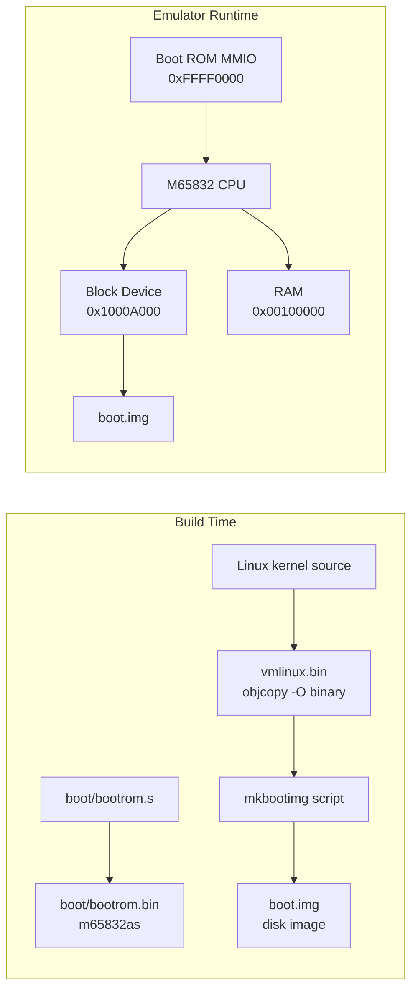
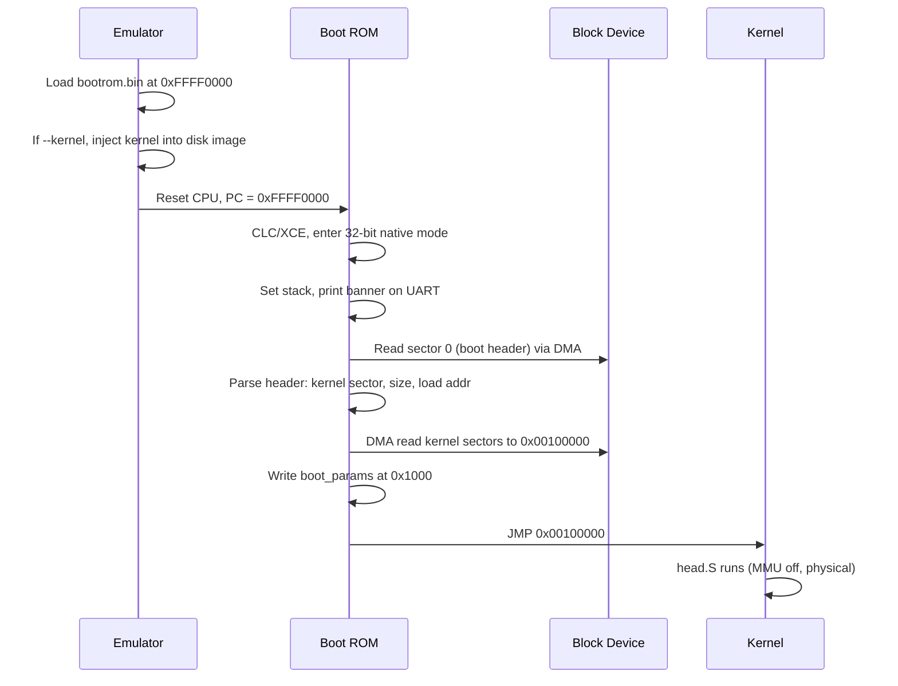
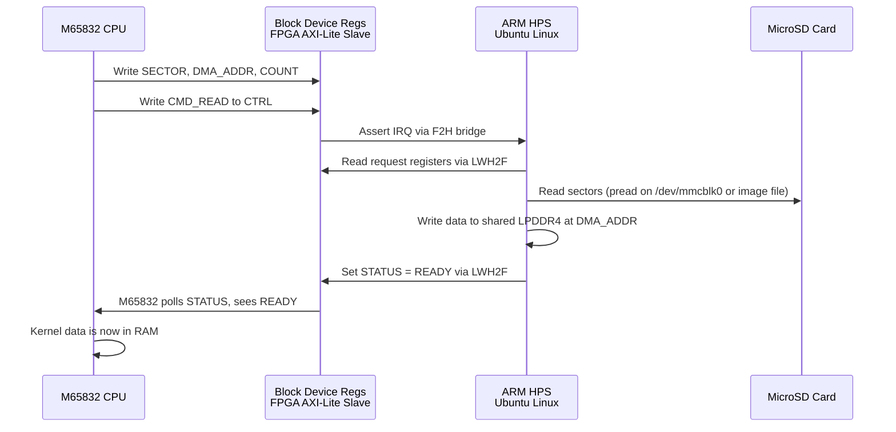

# M65832 Boot Process

**Boot ROM, Kernel Loading, and Hardware Boot Flow**

---

## 1. Overview

The M65832 uses a unified boot flow shared between the emulator and VHDL hardware.
A small boot ROM (4KB, stored in FPGA BRAM) initializes the CPU, loads the kernel
from the block device via DMA, and jumps to the kernel entry point. The Linux kernel
is loaded as a flat binary (`vmlinux.bin`) at a fixed physical address.

This design ensures the emulator boots identically to hardware -- the same boot ROM
binary runs in both environments.

> **Related docs:**
> - `M65832_System_Programming_Guide.md` -- Privilege model, MMU, interrupts
> - `M65832_Linux_Porting_Guide.md` -- Kernel entry conditions, early init
> - `M65832_Target_DE25.md` -- FPGA platform details

---

## 2. Boot Architecture

### 2.1 Build and Runtime Flow



The kernel build produces `vmlinux.bin` via `objcopy -O binary`. A `mkbootimg` script
packages this into a disk image with a boot header at sector 0. The boot ROM loads the
kernel from the disk image through the block device's DMA interface, then jumps to it.

### 2.2 Boot Sequence



---

## 3. Memory Map

The boot memory map is shared between emulator and VHDL:

| Address Range               | Description                              |
|-----------------------------|------------------------------------------|
| `0x00000000 - 0x00000FFF`   | Vectors / zero page                      |
| `0x00001000 - 0x00001FFF`   | Boot parameters (written by boot ROM)    |
| `0x00002000 - 0x000FFFFF`   | Scratch / free RAM                       |
| `0x00100000+`               | Kernel load area (`SYSTEM_KERNEL_LOAD`)  |
| `0x1000A000`                | Block device (SD controller) registers   |
| `0xFFFF0000 - 0xFFFF0FFF`   | Boot ROM (4KB, read-only MMIO)           |
| `0xFFFFF000 - 0xFFFFF0FF`   | System registers (MMU, timer)            |

The boot ROM resides at `0xFFFF0000` and is implemented as BRAM initialized from the
FPGA bitstream on hardware, or loaded from a `.bin` file by the emulator.

---

## 4. Boot ROM

### 4.1 Source and Assembly

The boot ROM is written in M65832 assembly (`boot/bootrom.s`) and assembled with
`m65832as` to produce `boot/bootrom.bin`. The same binary is used by:

- **Emulator:** Loaded as a read-only MMIO region at `0xFFFF0000`
- **VHDL:** Converted to BRAM initialization data for `m65832_bootrom.vhd`

### 4.2 Boot ROM Responsibilities

The boot ROM (~200 lines of assembly) performs:

1. **CPU initialization**
   - `CLC` / `XCE` to enter native mode
   - `REP #$30` / `REPE #$A0` for 32-bit native mode (M=10, X=10)
   - Set supervisor mode (S=1, already set at reset)
   - Initialize stack pointer to `$0000FFFF`

2. **UART banner**
   - Print `"M65832\r\n"` via polled TX at `$10006000` (DE25 UART base)

3. **Load boot header**
   - DMA read sector 0 from block device to scratch RAM at `$2000`
   - Validate magic (`"M65B"`)
   - Parse kernel sector, size, and load address from header

4. **Load kernel**
   - Set `DMA_ADDR = $00100000` (kernel load address)
   - Set `SECTOR_LO` = kernel start sector (from header, default 2048)
   - Set `COUNT` = number of sectors (kernel size / 512)
   - Issue `CMD_READ` to block device
   - Wait for `READY` status

5. **Prepare boot parameters**
   - Write `boot_params_t` structure at `$1000`:
     magic, memory size, kernel start, kernel size, UART base

6. **Jump to kernel**
   - Load boot params pointer into R0
   - `JMP $00100000` (kernel physical entry point)

### 4.3 Reset Vector

The boot ROM places a reset vector at ROM offset `$FFC`:

```asm
.ORG $FFFF0FFC
.LONG $FFFF0000          ; Reset vector -> ROM base
```

### 4.4 Register Constants

The boot ROM uses `.EQU` directives matching `platform_de25.h`:

```asm
; Block device registers (DE25_SD_BASE = $1000A000)
BLKDEV_BASE   .EQU $1000A000
BLKDEV_CTRL   .EQU $00          ; Command register (W)
BLKDEV_STATUS .EQU $04          ; Status register (R)
BLKDEV_SECTOR .EQU $0C          ; Sector number low (R/W)
BLKDEV_DMA    .EQU $38          ; DMA address (R/W)
BLKDEV_COUNT  .EQU $28          ; Block count (R/W)

; Commands
CMD_READ      .EQU $01
CMD_NOP       .EQU $00

; Status bits
STATUS_READY  .EQU $02
STATUS_ERROR  .EQU $08

; UART registers (DE25_UART_BASE = $10006000)
UART_BASE     .EQU $10006000
UART_DATA     .EQU $00
UART_STATUS   .EQU $04
UART_TX_READY .EQU $02
```

---

## 5. Disk Image Layout

The disk image uses standard MBR partitioning. The boot header occupies the first
32 bytes of sector 0 (within the MBR bootstrap area, before the partition table at
byte 446). The kernel build produces this image using standard tools available on
macOS via Homebrew (`e2fsprogs`, `fdisk`, `dd`).

### 5.1 Partition Layout

| Sectors       | Offset    | Content                                        |
|---------------|-----------|------------------------------------------------|
| 0             | 0         | MBR: boot header (bytes 0-31) + partition table (bytes 446-511) |
| 1 - 2047      | 512 - 1MB | MBR gap (reserved)                             |
| 2048+         | 1MB       | Partition 1: raw kernel image (`vmlinux.bin`)  |
| after kernel  | varies    | Partition 2: ext2 root filesystem              |

Sector 2048 is the standard first partition offset in modern MBR layouts. The
kernel build creates the partition table, writes the kernel to partition 1 as
raw sectors (no filesystem), and formats partition 2 as ext2 for the root filesystem.

### 5.2 Boot Header (Sector 0, bytes 0-31)

| Offset | Size    | Field                | Description                           |
|--------|---------|----------------------|---------------------------------------|
| `+0x00`| 4 bytes | `magic`              | `"M65B"` (`0x4236354D`)              |
| `+0x04`| 4 bytes | `version`            | Header version (currently `1`)        |
| `+0x08`| 4 bytes | `kernel_sector`      | Kernel start sector (default `2048`)  |
| `+0x0C`| 4 bytes | `kernel_size`        | Kernel size in bytes                  |
| `+0x10`| 4 bytes | `kernel_load_addr`   | Physical load address (`0x00100000`)  |
| `+0x14`| 4 bytes | `kernel_entry_offset`| Entry offset from load addr (usually `0`) |
| `+0x18`| 4 bytes | `flags`              | Boot flags (reserved)                 |
| `+0x1C`| 4 bytes | `reserved`           | Reserved for future use               |

The header fits within the MBR bootstrap code area (bytes 0-445). The MBR partition
table (bytes 446-509) and boot signature (bytes 510-511) are separate and not
overlapped.

### 5.3 C Structure

```c
#define BOOT_HEADER_MAGIC       0x4236354D  /* "M65B" little-endian */
#define BOOT_HEADER_VERSION     1
#define BOOT_KERNEL_SECTOR      2048        /* Partition 1 start (standard MBR) */

typedef struct {
    uint32_t magic;
    uint32_t version;
    uint32_t kernel_sector;
    uint32_t kernel_size;
    uint32_t kernel_load_addr;
    uint32_t kernel_entry_offset;
    uint32_t flags;
    uint32_t reserved;
} boot_header_t;
```

---

## 6. Block Device Interface

The boot ROM accesses the block device through memory-mapped registers at
`DE25_SD_BASE` (`0x1000A000`). The interface uses synchronous DMA: writing a
command triggers an immediate transfer between the disk and RAM.

### 6.1 Boot ROM Read Sequence

```asm
; Read N sectors from disk to RAM via DMA
;   Sector number in SECTOR_LO
;   DMA target address in DMA_ADDR
;   Sector count in COUNT
;   Issue CMD_READ, poll for completion

load_sectors:
    ; Set DMA destination address
    LDA #$00100000
    STA R8
    LDA #BLKDEV_BASE + BLKDEV_DMA
    STA R9
    LDA R8
    STA (R9)                ; DMA_ADDR = $00100000

    ; Set sector number
    LDA #2048               ; Kernel start sector
    STA R8
    LDA #BLKDEV_BASE + BLKDEV_SECTOR
    STA R9
    LDA R8
    STA (R9)                ; SECTOR_LO = 2048

    ; Set sector count
    LDA kernel_sectors
    STA R8
    LDA #BLKDEV_BASE + BLKDEV_COUNT
    STA R9
    LDA R8
    STA (R9)                ; COUNT = kernel_sectors

    ; Issue read command
    LDA #CMD_READ
    STA R8
    LDA #BLKDEV_BASE + BLKDEV_CTRL
    STA R9
    LDA R8
    STA (R9)                ; CMD = READ

    ; Poll for completion
.wait:
    LDA #BLKDEV_BASE + BLKDEV_STATUS
    STA R9
    LDA (R9)
    AND #STATUS_READY
    BEQ .wait               ; Loop until READY
    RTS
```

### 6.2 Register Summary

| Offset | Register     | Access | Boot ROM Usage                     |
|--------|-------------|--------|------------------------------------|
| `+0x00`| CTRL        | W      | Write command code (READ=`0x01`)   |
| `+0x04`| STATUS      | R      | Poll READY bit for completion      |
| `+0x0C`| SECTOR_LO   | R/W    | Sector number (low 32 bits)        |
| `+0x28`| COUNT       | R/W    | Number of sectors to transfer      |
| `+0x38`| DMA_ADDR    | R/W    | RAM destination address             |

> **See also:** `emu/blkdev.h` for the full register interface and `emu/platform_de25.h`
> for platform register definitions.

---

## 7. Kernel Entry Conditions

When the boot ROM jumps to the kernel, the CPU state is:

| Register/Flag | Value                    | Description                      |
|---------------|--------------------------|----------------------------------|
| PC            | `0x00100000`             | Physical kernel load address     |
| S flag        | `1`                      | Supervisor mode                  |
| E flag        | `0`                      | Native mode (not emulation)      |
| M bits        | `10`                     | 32-bit accumulator               |
| X bits        | `10`                     | 32-bit index registers           |
| I flag        | `1`                      | IRQs disabled                    |
| MMU           | Off                      | Physical addressing              |
| R0            | `0x00001000`             | Pointer to boot_params           |
| SP            | `0x0000FFFF`             | Initial stack (boot ROM stack)   |

The kernel's `head.S` (`_start`) then:

1. Saves the boot info pointer from R0
2. Sets up its own stack
3. Clears BSS
4. Sets up initial page tables (identity map + kernel map at `0x80000000`)
5. Enables MMU
6. Jumps to virtual address `start_kernel`

> **See:** `linux-m65832/arch/m65832/kernel/head.S` for the full kernel entry code.

---

## 8. Emulator Integration

### 8.1 Boot ROM MMIO Module

The emulator implements the boot ROM as a read-only MMIO region (`emu/bootrom.c`):

- `bootrom_load(cpu, filename)` -- Reads a `.bin` file and registers a 4KB read-only
  MMIO region at `0xFFFF0000`
- Read handler returns ROM bytes
- Write handler is a no-op (true ROM behavior)
- Called from `system_init()` during system startup

### 8.2 Emulator Boot Flow

1. `system_init()` creates CPU, UART, block device
2. `bootrom_load()` loads `boot/bootrom.bin` at `0xFFFF0000`
3. If `--kernel FILE` is given:
   - Create a temporary disk image with boot header + kernel binary
   - Attach disk image to block device
4. Reset CPU, set PC to `0xFFFF0000`
5. CPU executes boot ROM (identical to hardware)
6. Boot ROM loads kernel from block device via DMA
7. Boot ROM jumps to kernel at `0x00100000`

### 8.3 Command-Line Interface

```bash
# Full workflow: build kernel, create disk image, boot
make -C linux-m65832 vmlinux.bin
./scripts/mkbootimg --kernel linux-m65832/arch/m65832/boot/vmlinux.bin -o boot.img
./m65832emu --disk boot.img

# Convenience shorthand (emulator creates disk image automatically)
./m65832emu --kernel linux-m65832/arch/m65832/boot/vmlinux.bin

# Custom boot ROM (default: boot/bootrom.bin)
./m65832emu --bootrom path/to/bootrom.bin --disk boot.img
```

---

## 9. FPGA Hardware Integration

### 9.1 Boot ROM in BRAM

On hardware, the boot ROM binary is the same `boot/bootrom.bin`, converted to BRAM
initialization data for `m65832_bootrom.vhd`. The boot ROM content is embedded in
the FPGA bitstream and loaded into BRAM at configuration time.

The DE25-Nano (Agilex 5) and KV260 (Zynq UltraScale+) do not have true non-volatile
ROM on the FPGA fabric. The boot ROM is implemented as BRAM initialized from the
bitstream:

- Content is baked into the bitstream (`.sof` or `.bit`) at synthesis time
- BRAM is loaded when the FPGA configures (power-on or JTAG)
- At runtime, the address decoder maps `0xFFFF0000-0xFFFF0FFF` to the BRAM
- Writes to the ROM region are ignored

### 9.2 Block Device Bridge (HPS-Backed)

On both target boards (DE25-Nano, KV260), the MicroSD card is wired to the ARM HPS,
not to the FPGA fabric. The M65832 accesses block storage through a bridge: the FPGA
side presents the same block device register interface as the emulator, while the ARM
HPS services the actual I/O.

From the M65832's perspective, the block device at `0x1000A000` is indistinguishable
from a native SD controller. The boot ROM and Linux block device driver work unchanged
across emulator and hardware.

#### Architecture



#### FPGA Side: AXI-Lite Slave

The FPGA block device controller (`m65832_blkdev_bridge.vhd`) is a simple AXI-Lite
slave with the same register layout as the emulator's `blkdev`:

| Register    | Offset | FPGA Behavior                                  |
|-------------|--------|-------------------------------------------------|
| CTRL        | `+0x00`| Write triggers IRQ to ARM HPS                  |
| STATUS      | `+0x04`| Read by M65832, written by ARM                 |
| SECTOR_LO   | `+0x0C`| Read/write by both sides                       |
| DMA_ADDR    | `+0x38`| Physical address in shared LPDDR4              |
| COUNT       | `+0x28`| Sector count                                   |
| CAPACITY_LO | `+0x40`| Set by ARM at init time                        |

The controller has two AXI ports:

- **M65832 side**: Memory-mapped in the M65832 address space at `0x1000A000`
- **HPS side**: Connected via the Lightweight HPS-to-FPGA (LWH2F) bridge, so the
  ARM can read/write the same registers

When M65832 writes to CTRL, the FPGA asserts an IRQ line to the ARM HPS. When the
ARM writes READY to STATUS, the M65832 sees it on its next poll.

#### ARM Side: Linux Daemon (`m65832-blkd`)

Both target boards run full Ubuntu Linux on the ARM HPS (Ubuntu Desktop on DE25-Nano,
Ubuntu 22.04 on KV260). A lightweight Linux daemon services block device requests:

```
m65832-blkd --device /dev/mmcblk0p2 --regs 0xFF200000
```

The daemon:

1. **Maps FPGA registers** via `/dev/mem` or a UIO driver through the LWH2F bridge
2. **Opens the disk image** -- either a raw partition (`/dev/mmcblk0p2`), a file on
   the filesystem (`/home/user/boot.img`), or a loop device
3. **Waits for IRQ** (via UIO `/dev/uioN` or poll on the bridge)
4. **Reads the request** registers (sector, DMA addr, count, command)
5. **Services the I/O**:
   - READ: `pread()` from disk, write data to shared memory at DMA_ADDR
   - WRITE: read data from shared memory, `pwrite()` to disk
6. **Signals completion** by writing STATUS = READY

The daemon is ~200 lines of C. It uses `mmap()` for FPGA register access and standard
POSIX file I/O for disk access.

#### Shared Memory

Both boards have shared LPDDR4 accessible from both ARM and FPGA:

| Board     | Shared Memory | FPGA Access Path                    |
|-----------|---------------|-------------------------------------|
| DE25-Nano | 1GB LPDDR4    | F2H (FPGA-to-HPS) AXI bridge       |
| KV260     | 4GB DDR4      | HP (High Performance) AXI port      |

The DMA_ADDR register contains a physical address in this shared memory region. The
M65832's SDRAM controller is mapped into the same physical space, so after the ARM
writes data there, the M65832 can read it directly.

#### Platform Differences

| Aspect              | DE25-Nano (Agilex 5)           | KV260 (Zynq UltraScale+)       |
|---------------------|-------------------------------|----------------------------------|
| ARM register access | LWH2F bridge                  | AXI GP port (M_AXI_HPM0_LPD)    |
| FPGA memory access  | F2H bridge to HPS SDRAM       | S_AXI_HP0 port to PS DDR        |
| IRQ to ARM          | F2H IRQ lines                 | PL-to-PS interrupt (IRQ_F2P)     |
| Linux UIO base      | Platform Designer assigns     | Device tree overlay configures   |
| Ubuntu version      | Intel Linux BSP / Ubuntu      | Kria Ubuntu 22.04               |

### 9.3 Hardware Boot Flow

The full hardware boot sequence:

1. **Board powers on** -- ARM HPS boots Ubuntu from MicroSD
2. **FPGA configured** -- Bitstream loaded (from SD or JTAG), BRAM boot ROM initialized
3. **`m65832-blkd` starts** -- systemd service, maps FPGA registers, opens disk image
4. **M65832 released from reset** -- PC = `0xFFFF0000` (boot ROM)
5. **Boot ROM executes** -- identical code path to emulator:
   - CPU init, UART banner
   - DMA read boot header from sector 0
   - DMA read kernel from sector 2048 to `0x00100000`
   - Jump to kernel
6. **M65832 Linux boots** -- `head.S` runs, MMU enabled, `start_kernel`

The M65832 kernel image (`vmlinux.bin`) can live as a regular file on the ARM's
Ubuntu filesystem. The `m65832-blkd` daemon can serve either a raw partition or a
disk image file.

---

## 10. Build System

### 10.1 Boot ROM

```bash
# Assemble boot ROM
cd boot/
m65832as bootrom.s -o bootrom.bin
```

### 10.2 Bootable Disk Image

```bash
# Create disk image with kernel
./scripts/mkbootimg --kernel path/to/vmlinux.bin -o boot.img

# Options:
#   --kernel FILE    Kernel flat binary (vmlinux.bin)
#   --load-addr ADDR Kernel load address (default: 0x00100000)
#   --sector OFFSET  Kernel start sector (default: 2048)
#   --size SIZE      Disk image size (default: 64MB)
#   -o FILE          Output disk image path
```

The `mkbootimg` script:

1. Creates a sparse disk image (default 64MB)
2. Writes the 32-byte boot header at sector 0
3. Writes `vmlinux.bin` at sector 2048 (1MB offset)

### 10.3 Linux Kernel

The kernel's existing `make vmlinux.bin` target
(`arch/m65832/boot/Makefile`) produces the flat binary via `objcopy -O binary`.
No changes to the kernel build are needed.

---

## 11. Files Reference

### New Files

| File                              | Description                                          |
|-----------------------------------|------------------------------------------------------|
| `boot/bootrom.s`                  | Boot ROM assembly source (shared emulator + VHDL)    |
| `boot/bootrom.bin`                | Assembled boot ROM binary (4KB)                      |
| `boot/Makefile`                   | Build rules for boot ROM                             |
| `emu/bootrom.c`                   | Emulator boot ROM MMIO module                        |
| `emu/bootrom.h`                   | Boot ROM module header                               |
| `emu/boot_header.h`              | Boot header structure (shared with scripts)          |
| `scripts/mkbootimg`               | Script to create bootable disk images                |
| `hw/m65832_blkdev_bridge.vhd`    | FPGA block device AXI-Lite slave (HPS-backed)        |
| `hw/m65832-blkd.c`               | ARM Linux daemon for block device service            |
| `hw/m65832-blkd.service`         | systemd unit file for auto-start on ARM boot         |

### Modified Files

| File                              | Change                                               |
|-----------------------------------|------------------------------------------------------|
| `emu/system.c`                    | Load boot ROM, set PC to `0xFFFF0000` at reset       |
| `emu/main.c`                      | Add `--bootrom` flag, `--kernel` creates disk img    |
| `emu/system.h`                    | Add boot header constants                            |
| `syn/de25/m65832_de25_top.vhd`   | Instantiate blkdev bridge, connect HPS bridges       |
| `syn/de25/m65832_bootrom.vhd`    | Replace hand-coded bytes with generated BRAM init    |
